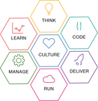

---

copyright:
  years: 2017

lastupdated: "2017-5-30"

---
<!-- Copyright info at top of file: REQUIRED
    The copyright info is YAML content that must occur at the top of the MD file, before attributes are listed.
    It must be surrounded by 3 dashes.
    The value "years" can contain just one year or a two years separated by a comma. (years: 2014, 2016)
    Indentation as per the previous template must be preserved.
-->

{:new_window: target="_blank"}
{:shortdesc: .shortdesc}
{:screen:.screen}
{:codeblock:.codeblock}

# Continuous delivery practices
{: #gm_cd_best}

  The [IBM&reg; Cloud Garage Method ](https://www.ibm.com/devops/method){:new_window} is the IBM approach to rapidly deliver engaging applications. It combines continuous delivery with IBM Design Thinking, lean, DevOps, and agile practices. Those practices are focused on the cloud, but can benefit any software development effort.

## Adopting continuous delivery practices
{: #gm_cd_adopt}

To learn how to adopt a continuous delivery approach in your organization, use these Cloud Garage Method articles, tutorials and online courses, which are arranged from basic to advanced.

## Continuous delivery articles
{: #gm_cd_articles}

These articles provide conceptual overviews of continuous delivery.

[Continuous Delivery ](https://www.ibm.com/devops/method/content/deliver/tool_continuous_delivery/){:new_window} is a practice by which you build and deploy your software so that it can be released into production at any time. One of the hallmarks of computer science is the shortening of various cycle times in the development and operations process.

With [Delivery Pipeline ](https://www.ibm.com/devops/method/content/deliver/tool_delivery_pipeline/){:new_window}, which is included in IBM Bluemix Continuous Delivery, you can achieve continuous delivery in a consistent and reliable way by dividing the software delivery process into stages. The goal is for code to progress through each stage automatically with minimal human intervention.

## Continuous delivery tutorials
{: #gm_cd_tutorials}

[DevOps toolchains ](https://www.ibm.com/devops/method/category/tools){:new_window}. Combine {{site.data.keyword.Bluemix_notm}} services with open source and third-party tools to enable your team and align your DevOps methodology.

[Create a pipeline ](https://www.ibm.com/devops/method/tutorials/tutorial_first_pipeline){:new_window}. Learn how to start with a pipeline and create an open toolchain that includes a GitHub repo and the pipeline.

[Create and use your first toolchain ](https://www.ibm.com/devops/method/tutorials/tutorial_toolchain_flow){:new_window}. Learn how to create an open toolchain from a template and use the toolchain to continuously deliver a "Hello World" app.

[Add a toolchain to an app ](https://www.ibm.com/devops/method/tutorials/tutorial_app_to_toolchain?=task1){:new_window}. Learn how to add an open toolchain to an app and use the toolchain to continuously deliver the app.

[Create and use a microservices toolchain ](https://www.ibm.com/devops/method/tutorials/tutorial_toolchain_microservices){:new_window}. Learn how to create a toolchain from a template with three microservices and use the toolchain to continuously deliver a "Hello World" app.

[Create and use a microservices toolchain with {{site.data.keyword.DRA_short}} (v2) ](https://www.ibm.com/devops/method/tutorials/tutorial_toolchain_microservices_cd?task=1){:new_window}. Learn how to set up an open toolchain that develops and continuously delivers a microservices app.

[Create a toolchain that uses {{site.data.keyword.gitrepos}} ](https://www.ibm.com/devops/method/tutorials/tutorial_toolchain_cfv2){:new_window}. Create an open toolchain from a template that includes a Cloud Foundry app and uses {{site.data.keyword.gitrepos}}. Then, use the toolchain to continuously deliver the app.

## Continuous delivery courses
{: #gm_cd_courses}

[Get started with agile development and continuous delivery ](https://www.ibm.com/devops/method/content/course/get_started_agile_cd){:new_window}. Learn how to create a toolchain from a template and use the toolchain to continuously deliver a "Hello World" app.

[Become an IBM Cloud Garage Method advocate ](https://www.ibm.com/devops/method/content/course/gm_advocate){:new_window}. Take this advanced course to get experience with the practices and tools from the Cloud Garage Method.

To see all of the Cloud Garage Method learning materials, see the [Cloud Garage Method Learning Lab ](https://www.ibm.com/devops/method/category/courses){:new_window}.
