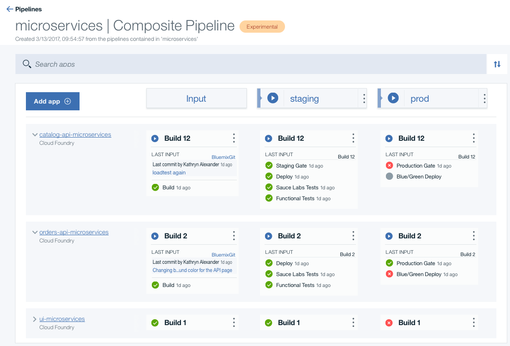
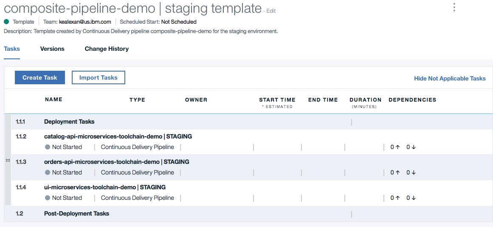

---

copyright:
  years: 2017
lastupdated: "2017-4-5"
---
<!-- Copyright info at top of file: REQUIRED
    The copyright info is YAML content that must occur at the top of the MD file, before attributes are listed.
    It must be surrounded by 3 dashes.
    The value "years" can contain just one year or a two years separated by a comma. (years: 2014, 2016)
    Indentation as per the previous template must be preserved.
-->

{:new_window: target="_blank"}
{:shortdesc: .shortdesc}
{:screen:.screen}
{:codeblock:.codeblock}

# Mit Kombinationspipelines arbeiten (Experimentell)
{: #deliverypipeline_create_composite}

Mit dem Feature der Kombinationspipelines für {{site.data.keyword.deliverypipeline}} können Sie reproduzierbare, kontinuierliche Integrations- und Continuous Delivery-Prozesses für zusammengehörige Software-Apps verwalten.
{:shortdesc}

Sie erstellen Kombinationspipelines, um die Apps in einer Toolchain zu verwalten. Wenn Ihre Toolchain Apps enthält, die von {{site.data.keyword.deliverypipeline}} bereitgestellt werden, wird die Toolchain dynamisch aktualisiert, wenn Sie Delivery Pipelines zu ihr hinzufügen oder aus ihr entfernen. Sie können auch Apps aus externen Quellen zu der Kombinationspipeline hinzufügen.

## Kombinationspipeline erstellen
{: #compositepipeline_create_for_toolchain}

1. Klicken Sie im Menü nahe dem Bluemix-Logo auf **Services > DevOps**.

1. Klicken Sie im Navigationsfenster links auf **Pipelines**.

2. Aktivieren Sie das Feature für Kombinationspipelines, indem Sie zunächst auf **Weitere Informationen** und dann auf **Aktivieren** klicken. Die Kombinationspipeline wird für jeden Benutzer aktiviert, sodass nur diejenigen Mitglieder Ihrer Organisation (org) die von Ihnen erstellten Kombinationspipelines sehen können, die sich ausdrücklich für das experimentelle Feature entschieden haben.

2. Klicken Sie auf **Erstellen** > **Kombinationspipeline**.

3. Geben Sie einen Namen für die Kombinationspipeline ein. Sie können auch die Beschreibung für die Pipeline ändern.

4. Wählen Sie in der Liste **Toolchain** eine Toolchain aus.

    1. Wenn Sie eine leere Toolchain und eine Kombinationspipeline erstellen wollen, wählen Sie **Neu** aus.

    2. Wenn Sie eine Kombinationspipeline für eine ihrer vorhandenen Toolchains erstellen wollen, wählen Sie den betreffenden Namen aus.

5. Wenn Sie eine leere Toolchain erstellen wollen, wählen Sie **Standardumgebungen hinzufügen** aus. Mit diesen standardmäßigen logischen Umgebungen steuern Sie die Prozessausführung im Verlauf der Kombinationspipeline.

6. Klicken Sie auf **Erstellen**.

Die von Ihnen konfigurierten Stages werden automatisch dem entsprechenden Bereich (Space) in Ihrer Organisation zugeordnet und es wird ein Bereitstellungsplan für die Kombinationspipeline erstellt.

Wenn Sie die Kombinationspipeline für eine Toolchain erstellt haben, die Delivery Pipelines enthält, werden für alle Pipelines in der Toolchain Apps zu der Kombinationspipeline hinzugefügt. Die von Ihnen und der Delivery Pipeline konfigurierten Stages werden automatisch den entsprechenden Bereichen (Spaces) in Ihrer Organisation zugeordnet und ihr Status wird angezeigt.
Um den Status für jeden Job in einer App anzuzeigen, erweitern Sie die betreffende App.

Für die Kombinationspipeline wird auch ein Bereitstellungsplan erstellt. Standardmäßig werden Jobs für alle Apps in einem Bereich parallel ausgeführt. Sie können für Ihre Apps im Plan die Reihenfolge der Bereitstellung jedoch ändern.

Wenn Sie die Kombinationspipeline für eine neue Toolchain erstellt haben, wird ein Bereitstellungsplan erstellt, den Sie anpassen können.

## Bereitstellungsplan ändern
{: #compositepipeline_modify_dp}

Standardmäßig wird für eine Kombinationspipeline ein Bereitstellungsplan erstellt. In diesem Bereitstellungsplan wird die gesamte Information zu den Stages in jeglichen Delivery Pipelines in der Toolchain erfasst. Sie können den Bereitstellungsplan für jede Stage anzeigen und ändern.

Klicken Sie in der Stage, für die Sie Änderungen im Bereitstellungsplan vornehmen wollen, auf das Menü und dann auf **Bereitstellungsplan**.

Die Liste der Bereitstellungstasks für Ihre Umgebung wird angezeigt.

Weitere Informationen zum Durchführen von Änderungen am Bereitstellungsplan enthält [Bereitstellungspläne für Kombinationspipelines anpassen](/docs/services/ContinuousDelivery/pipeline_deployment_plan.html).

## Änderungen an einzelnen Pipelines vornehmen
{: #compositepipeline_add_job}

Sie können an den einzelnen Pipelines der Kombinationspipeline Änderungen vornehmen.

1. Erweitern Sie die App.

2. Klicken Sie im Menü der Stage auf **Konfigurieren**.

3. Fügen Sie Jobs zu der Stage hinzu, nehmen Sie Änderungen an den Jobs der Stage vor oder entfernen Sie Jobs aus der Stage. Detaillierte Anweisungen hierzu enthält [Einen Job zu einer Stage hinzufügen](pipeline_build_deploy.html#deliverypipeline_add_job).

## Jobs in einer Kombinationspipeline ausführen
{: #compositepipeline_run_jobs}

Nachdem Sie eine App erweitert haben, um ihre Jobs anzuzeigen, können Sie alle Jobs der App in einer Stage manuell ausführen. Klicken Sie in dem Bereich für eine App auf das Symbol **Bereitstellen in *Stage***.

Wenn Sie alle Jobs in allen Apps in einem Bereich ausführen wollen, klicken Sie in dem Bereich für die Kombinationspipeline auf das Symbol **Bereitstellen in *Bereich***.

Die Jobs werden gemäß dem Bereitstellungsplan des Kombinationsblueprints ausgeführt.

## Protokolle anzeigen
{: #compositepipeline_view_logs}

Sie können die Protokolle für einen Job anzeigen, indem Sie die App erweitern, die den betreffenden Job enthält, und dann auf den Job klicken.

## IBM Bluemix DevOps Connect zum Integrieren mit IBM UrbanCode Deploy verwenden
{: #compositepipeline_devops_connect}

IBM Bluemix DevOps Connect koordiniert die Kommunikation zwischen Ihrer lokalen IBM&reg; UrbanCode&reg; Deploy-Installation und {{site.data.keyword.contdelivery_short}}. Nach der Installation von DevOps Connect können Sie Integrationen erstellen, die Sie zum Verwalten von IBM UrbanCode Deploy-Apps mit Kombinationspipelines verwenden können.

**Voraussetzungen**

   * Zum Registrieren von DevOps Connect benötigen Sie eine IBMid.

   * Stellen Sie sicher, dass [Java&trade; Runtime Environment Version 8 Aktualisierung 121 oder höher ](https://java.com/en/download/){:new_window} auf dem Hostsystem verfügbar und die Position in der PATH-Variablen des Systems festgelegt ist.

   * Sie benötigen ein Administratorberechtigungstoken von IBM UrbanCode Deploy.

Führen Sie die folgenden Schritte aus, um DevOps Connect zum Integrieren mit IBM UrbanCode Deploy zu verwenden:

1. Installieren Sie DevOps Connect und verwenden Sie die App, um Ihre Organisation mit IBM UrbanCode Deploy zu integrieren.

  1. Klicken sie in einer Kombinationspipeline auf **App hinzufügen**. Wählen Sie in der Liste **Verwaltet von** den Eintrag für **IBM UrbanCode Deploy** aus.

  1. Zeigen Sie die Integrationsschritte an. Wenn eine Liste von Apps angezeigt wird, klicken Sie für **Apps** zuerst auf das Informationssymbol () und klicken Sie dann auf **IBM UrbanCode Deploy für diese Organisation konfigurieren**.

  1. Klicken Sie im Fenster 'UrbanCode Deploy Integration konfigurieren' auf **Herunterladen**, um DevOps Connect herunterzuladen. Legen Sie die JAR-Datei auf einem Computer ab, der auf IBM UrbanCode Deploy zugreifen kann.

  1. Kopieren Sie das DevOps Connect-Installationsscript im Fenster. Das Script enthält den Befehl zum Starten von DevOps Connect und die Berechtigungsnachweise, die zum Identifizieren Ihres {{site.data.keyword.contdelivery_short}}-Service erforderlich sind.

  1. Öffnen Sie auf dem Computer, auf dem Sie DevOps Connect platziert haben, eine Befehlsshell und fügen Sie dort das kopierte Script ein.

  1. Führen Sie das Script aus. DevOps Connect zeigt Startnachrichten an.

1. Registrieren Sie DevOps Connect.

  1.  Öffnen Sie auf dem Computer, auf dem Sie DevOps Connect platziert haben, das DevOps Connect-Dashboard mit einem Web-Browser. Die Standard-URL ist https://localhost:8443. Informationen dazu, wie Sie die URL ändern, und weitere Informationen zu anderen Startoptionen enthält die [DevOps Connect-Dokumentation ](https://developer.ibm.com/urbancode/plugindoc/urbancode-sync/ibm-urbancode-sync-utility/1-2/){:new_window}.

1. Geben Sie auf der Seite für die Anmeldung bei IBM Ihre IBMid mit dem zugehörigen Kennwort ein und klicken Sie auf **Anmelden**. Diese Anmeldung müssen Sie bei jedem Start von DevOps Connect durchführen.

1. Verwenden Sie mit DevOps Connect das Plug-in IBM UrbanCode Deploy für DevOps Connect, um eine Integration zwischen Ihrer Organisation und IBM UrbanCode Deploy zu erstellen.

    1. Klicken Sie auf der Seite für Integrationen auf **Neu hinzufügen**.

    1. Geben Sie im Feld **Name** einen Namen für die Integration ein.

    1. Wählen Sie in der Liste **Integrationstyp** den Eintrag für **IBM UrbanCode Deploy für DevOps Connect** aus.

    1. Geben Sie im Feld **Server-URI** die öffentliche URL des IBM UrbanCode Deploy-Servers ein, zum Beispiel `https://mein_UCD.example.com:8443`.

    1. Geben Sie im Feld **Authentifizierungstoken** das von IBM UrbanCode Deploy generierte Authentifizierungstoken ein oder fügen Sie es ein.

    1. Geben Sie im Feld **E-Mail von Benutzer mit Administratorberechtigung** Ihre E-Mail-Adresse ein.

    1. Vergewissern Sie sich, dass die Integration erfolgreich erfolgt ist. Klicken Sie dazu auf **Integration ausführen**. DevOps Connect stellt eine Verbindung zu der im Feld **Server-URI** angegebenen Instanz von IBM UrbanCode Deploy her. Die entsprechende Berechtigung bezieht DevOps Connect über das Token, das im Feld **Authentifizierungstoken** angegeben ist.

    1. Klicken Sie auf **Speichern**.

Wenn Ihre Integration erfolgreich durchgeführt wurde, können Sie IBM UrbanCode Deploy-Apps zu Ihren Kombinationspipelines hinzufügen. Weitere Informationen enthält [Apps von IBM UrbanCode Deploy hinzufügen](/docs/services/ContinuousDelivery/pipeline_composites.html#compositepipeline_add_apps).

## Apps von IBM UrbanCode Deploy hinzufügen
{: #compositepipeline_add_apps}

Wenn Sie Mitglied einer Organisation sind, die mithilfe von DevOps Connect mit IBM UrbanCode Deploy integriert ist, können Sie die Apps, auf die Sie in IBM UrbanCode Deploy Zugriff besitzen, zur Kombinationspipeline hinzufügen. Installationsanweisungen enthält [IBM Bluemix DevOps Connect zum Integrieren mit IBM UrbanCode Deploy verwenden](/docs/services/ContinuousDelivery/pipeline_composites.html#compositepipeline_devops_connect).

Wenn Sie Mitglied einer Organisation sind, die mit IBM UrbanCode Deploy verbunden ist, können Sie UrbanCode Deploy-Apps zu Kombinationspipelines hinzufügen, die App-Prozesse auswählen, die in den Bereitstellungsplan aufgenommen werden sollen, und die Bereitstellung der Apps anpassen.

1. Klicken von der Kombinationspipeline aus auf **App hinzufügen**.

2. Wählen Sie in der Liste **Verwaltet von** den Eintrag für **IBM UrbanCode Deploy** aus. Falls Sie {{site.data.keyword.contdelivery_short}} erst vor Kurzem mit IBM UrbanCode Deploy integriert haben, müssen Sie gegebenenfalls die Browseranzeige aktualisieren, damit Ihr Server angezeigt wird.

3. Wählen Sie die Apps aus, die hinzugefügt werden sollen, und klicken Sie auf **Weiter**. Es werden alle App-Prozesse angezeigt, die IBM UrbanCode Deploy-Apps zur Verfügung stehen. Die Einträge zum Ausführen der von Ihnen ausgewählten Prozesse werden zum Bereitstellungsplan hinzugefügt.

4. Wählen Sie die App-Prozesse aus, die für die Apps verwendet werden sollen. Verwenden Sie bei der Suche nach Prozessen die Such- und Filteroptionen.

5. Klicken Sie auf **Speichern**. Jede von Ihnen ausgewählte IBM UrbanCode Deploy-App wird in der Kombinationspipeline als App angezeigt.

6. Ordnen Sie den logischen Umgebungen der Kombinationspipelines wie folgt Umgebungen aus den IBM UrbanCode Deploy-Apps zu:

    1. Wählen Sie im Menü nahe dem Namen einer logischen Umgebung die Option **Logische Umgebungen verwalten** aus.

    

    2. Wählen Sie für jede App in der Kombinationspipeline Umgebungen aus, die Sie in IBM UrbanCode Deploy haben. Die von Ihnen ausgewählten App-Prozesse werden nur in den Umgebungen dieser App ausgeführt.

    3. Klicken Sie auf **Speichern**.

    4. Wiederholen Sie diese Schritte für jede logische Umgebung, die Sie verwenden.
