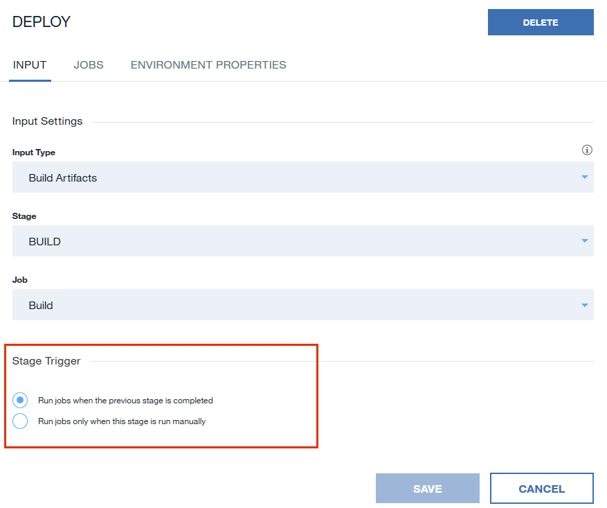
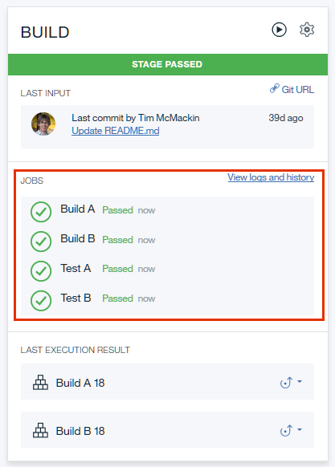

---

copyright:
  years: 2016, 2017
lastupdated: "2017-4-4"
---

{:new_window: target="_blank"}
{:shortdesc: .shortdesc}
{:screen:.screen}
{:codeblock:.codeblock}

# A propos de Delivery Pipeline
{: #deliverypipeline_about}

Le service IBM Bluemix {{site.data.keyword.deliverypipeline}}, également appelé pipeline, automatise le déploiement en continu de vos projets Bluemix. Dans un pipeline, des séquences d'étapes permettent d'extraire des entrées et d'exécuter des travaux, par exemple, des générations, des tests et des déploiements.
{:shortdesc}

Les sections ci-après décrivent les détails des concepts relatifs aux pipelines.

## Etapes
{: #deliverypipeline_stages}

Les étapes organisent des entrées et des travaux à mesure que votre code est généré, déployé et testé. Les étapes acceptent des entrées depuis
les référentiels de contrôle des sources (référentiels SCM) ou les travaux de génération (artefacts de génération) d'autres étapes. Lorsque vous créez votre première étape, les paramètres par défaut sont définis pour vous sur l'onglet **Entrée**.

Une entrée d'étape est transmise aux travaux qu'elle contient et chaque travail se voit attribuer un conteneur vide dans lequel il s'exécute. Les travaux d'une étape ne peuvent pas se transmettre des artefacts les uns les autres.

Vous pouvez définir des propriétés d'environnement d'étape qui peuvent être utilisées dans tous les travaux. Par exemple, vous pouvez définir une propriété `TEST_URL` qui transmet une URL unique afin de déployer et tester des travaux dans une seule étape. Le travail de déploiement sera déployé sur cette URL et le travail de test testera l'application active au niveau de l'URL.

Par défaut, dans une étape, les générations et les déploiements sont exécutés automatiquement chaque fois que des modifications sont transmises au
référentiel SCM d'un projet. Les étapes et les travaux s'exécutent en série ; ils activent le contrôle du débit pour votre travail. Par exemple, vous pouvez placer une étape de test avant une étape de déploiement. Si les tests de l'étape de test échouent, l'étape de déploiement ne s'exécute pas.

Vous souhaiterez peut-être avoir un contrôle plus strict d'une étape spécifique. Si vous ne souhaitez pas qu'une étape s'exécute à chaque fois qu'une modification se produit au niveau de son entrée, vous pouvez désactiver cette fonction. Sur l'onglet **Entrée**, dans la section Déclencheur d'étape, cliquez sur **Exécuter les travaux lorsque cette étape est exécutée manuellement**.

## Travaux
{: #deliverypipeline_jobs}

Un travail est une unité d'exécution au sein d'une étape. Une étape peut contenir plusieurs travaux et les travaux d'une étape s'exécutent de manière séquentielle. Par défaut, si un travail échoue, les travaux suivants dans cette étape ne s'exécutent pas.

Les travaux s'exécutent dans des répertoires de travail discrets au sein de conteneurs Docker créés pour chaque exécution de pipeline. Avant l'exécution d'un travail, son répertoire de travail est renseigné avec des entrées définies au niveau de l'étape. Par exemple, vous pouvez avoir une étape qui contient un travail de test et un travail de déploiement. Si vous installez des dépendances sur un travail, elles ne sont pas disponibles pour l'autre travail. Toutefois, si vous rendez les dépendances disponibles dans l'entrée de l'étape, elles sont disponibles pour les deux travaux.

A l'exception des travaux de génération de type simple, lorsque vous configurez un travail, vous pouvez inclure des scripts shell UNIX qui incluent des commandes de génération, de test ou de déploiement. Les travaux étant exécutés dans des conteneurs ad hoc, les actions sur un travail ne peuvent pas affecter les environnements d'exécution d'autres travaux, même si ces travaux font partie de la même étape.

En outre, les travaux de pipeline peuvent exécuter uniquement les commandes suivantes en tant que `sudo` :
  * `/usr/sbin/service`
  * `/usr/bin/apt-get`
  * `/usr/bin/apt-key`
  * `/usr/bin/dpkg`
  * `/usr/bin/add-apt-repository`
  * `/opt/IBM/node-v0.10.40-linux-x64/npm`
  * `/opt/IBM/node-v0.12.7-linux-x64/npm`
  * `/opt/IBM/node-v4.2.2-linux-x64/npm`
  * `/usr/bin/Xvfb`
  * `/usr/bin/pip`

Une fois qu'un travail est exécuté, le conteneur qui a été créé pour lui est supprimé. Les résultats de l'exécution d'un travail peuvent être conservés, mais l'environnement dans lequel ce travail a été exécuté n'est pas conservé.

**Remarque** : L'exécution des travaux peut prendre jusqu'à 60 minutes. Lorsque des travaux dépassent cette limite, ils échouent. Si un travail dépasse la limite, scindez-le en plusieurs travaux. Par exemple, si un travail effectue trois tâches, vous pouvez le scinder en trois travaux, un pour chaque tâche.

Pour savoir comment ajouter un travail à une étape, voir [Ajout d'un travail à une étape](/docs/services/ContinuousDelivery/pipeline_build_deploy.html#deliverypipeline_add_job){: new_window}.

### Travaux de génération

Les travaux de génération compilent votre projet dans le cadre de la préparation au déploiement. Ils génèrent des artefacts qui peuvent être envoyés à un répertoire d'archivage de génération, bien que par défaut, les artefacts soient placés dans le répertoire racine du projet.

Les travaux qui utilisent des entrées provenant de travaux de génération doivent faire référence à des artefacts de génération figurant dans la même structure que celle dans laquelle ils ont été créés. Par exemple, si un travail de génération procède à l'archivage d'artefacts de génération dans un répertoire `output`, un script de déploiement doit faire référence au répertoire `output` et non au répertoire cible de projet pour déployer le projet compilé. Vous pouvez spécifier le répertoire d'archivage en indiquant son nom dans la zone **Répertoire d'archivage de génération**. Si
vous laissez la zone vide, l'archivage est effectué dans le répertoire racine.

**Remarque** : Si vous sélectionnez le type de générateur **Simple** pour un travail de génération, vous ignorez le processus de génération. Dans ce cas, votre code n'est pas compilé, mais envoyé à l'étape de déploiement en l'état. Pour la génération et le déploiement, sélectionnez un type de générateur autre que **Simple**.

#### Propriétés d'environnement pour les scripts de génération
Vous pouvez inclure des propriétés d'environnement au sein des commandes shell de génération d'un travail de génération. Les propriétés permettent d'accéder aux informations relatives à l'environnement d'exécution du travail. Pour plus d'informations, voir [Propriétés et ressources d'environnement pour le {{site.data.keyword.deliverypipeline}}service](/docs/services/ContinuousDelivery/pipeline_deploy_var.html).

### Travaux de déploiement

Les travaux de déploiement téléchargent votre projet dans Bluemix en tant qu'application et sont accessibles depuis une URL. Une fois qu'un projet est déployé, l'application déployée figure sur votre tableau de bord Bluemix.

Les travaux de déploiement peuvent déployer de nouvelles applications ou mettre à jour des applications existantes. Même si vous déployez une application à l'aide d'une autre méthode, par exemple, l'interface de ligne de commande Cloud Foundry ou la barre d'exécution de l'interface IDE Web, vous pouvez mettre à jour l'application à l'aide d'un travail de déploiement. Pour mettre à jour une application, dans le travail de déploiement, utilisez le nom de cette application.

Vous pouvez effectuer le déploiement dans une ou plusieurs régions et dans un ou plusieurs services. Par exemple, vous pouvez configurer votre {{site.data.keyword.deliverypipeline}} en vue d'utiliser un ou plusieurs services, le tester dans une région, et le déployer en production dans plusieurs régions. Pour plus d'informations, voir
[Régions](/docs/overview/whatisbluemix.html#ov_intro_reg){: new_window}.

#### Propriétés d'environnement pour les scripts de déploiement

Vous pouvez inclure des propriétés d'environnement au sein du script de déploiement d'un travail de déploiement. Ces propriétés permettent d'accéder aux informations relatives à l'environnement d'exécution du travail. Pour plus d'informations, voir [Propriétés et ressources d'environnement pour le {{site.data.keyword.deliverypipeline}}service](/docs/services/ContinuousDelivery/pipeline_deploy_var.html).

### Travaux de test
Si vous voulez exiger que des conditions soient respectées, ajoutez des travaux de test avant ou après vos travaux de génération et de déploiement. Vous pouvez personnaliser des travaux de test pour qu'ils soient simples ou complexes selon vos besoins. Par exemple, vous pouvez exécuter une commande cURL et attendre une réponse spécifique. Vous pouvez également exécuter une suite de tests unitaires ou des tests fonctionnels avec des services de test tiers, tels que Sauce Labs.

Si vos tests génèrent des fichiers de
résultats au format JUnit XML, un rapport qui s'appuie sur les fichiers de résultats apparaît dans l'onglet **Tests** de chaque page de résultat de test. Si un test échoue, le travail échoue également.

#### Propriétés d'environnement pour les scripts de test

Vous pouvez inclure des propriétés d'environnement dans le script d'un travail de test. Les propriétés permettent d'accéder aux informations relatives à l'environnement d'exécution du travail. Pour plus d'informations, voir [Propriétés et ressources d'environnement pour le {{site.data.keyword.deliverypipeline}}service](/docs/services/ContinuousDelivery/pipeline_deploy_var.html).

## Fichiers manifeste
{: #deliverypipeline_manifest}

Les fichiers manifeste, appelés `manifest.yml` et stockés dans le répertoire racine d'un projet, contrôlent la façon dont le projet est déployé dans Bluemix. Pour savoir comment créer des fichiers manifeste pour un projet, consultez la [documentation Bluemix sur les manifestes d'application](/docs/manageapps/depapps.html#appmanifest). Pour s'intégrer à Bluemix, votre projet doit contenir un fichier manifeste dans son répertoire racine. Toutefois, vous n'êtes pas obligé d'effectuer le déploiement conformément aux informations du fichier.

Dans le pipeline, vous pouvez indiquer tout ce qu'un fichier manifeste peut contenir à l'aide d'arguments de commande `cf push`. Les arguments de commande `cf push` sont utiles dans les projets qui possèdent plusieurs projets de déploiement. Si plusieurs travaux de déploiement tentent d'utiliser la route spécifiée dans le fichier manifeste du projet, un conflit se produit.

Pour éviter les conflits, vous pouvez spécifier une route en utilisant la commande `cf push` suivie de l'argument de nom d'hôte, `-n` et d'un nom de route. En modifiant le script de déploiement pour des étapes individuelles, vous pouvez éviter des conflits de route lorsque vous procédez au déploiement sur plusieurs cibles.

Pour utiliser les arguments de commande `cf push`, ouvrez les paramètres de configuration pour un travail de déploiement et modifiez la zone **Script de déploiement**. Pour plus d'informations, consultez la [documentation Cloud Foundry Push ](http://docs.cloudfoundry.org/devguide/installcf/whats-new-v6.html#push){: new_window}.

## Exemple de pipeline
{: #deliverypipeline_example}

Un pipeline simple peut contenir trois étapes :

1. Une étape de génération qui compile et exécute des processus de génération sur une application.
2. Une étape de test qui déploie une instance de l'application puis exécute des tests sur cette instance.
3. Une étape de production qui déploie une instance de production de l'application testée.

Ce pipeline est affiché dans le diagramme conceptuel suivant :

*Modèle conceptuel d'un pipeline composé de trois étapes*

Les étapes prennent leur entrée dans des référentiels et des travaux de génération et les travaux au sein d'une étape s'exécutent de façon séquentielle et indépendamment les uns des autres. Dans l'exemple de pipeline, les étapes s'exécutent de manière séquentielle, même si les étapes de test et de production utilisent la sortie de l'étape de génération comme entrée.
