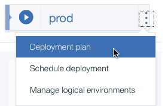
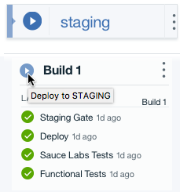
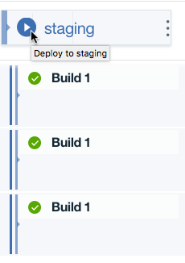

---

copyright:
  years: 2017
lastupdated: "2017-8-18"
---
<!-- Copyright info at top of file: REQUIRED
    The copyright info is YAML content that must occur at the top of the MD file, before attributes are listed.
    It must be surrounded by 3 dashes.
    The value "years" can contain just one year or a two years separated by a comma. (years: 2014, 2016)
    Indentation as per the previous template must be preserved.
-->

{:new_window: target="_blank"}
{:shortdesc: .shortdesc}
{:screen:.screen}
{:codeblock:.codeblock}

# 컴포지트 파이프라인 관련 작업(시범)
{: #deliverypipeline_create_composite}

{{site.data.keyword.deliverypipeline}}의 컴포지트 파이프라인 기능을 사용하면 관련 소프트웨어 앱에 대한 반복 가능한 지속적 통합 및 지속적 딜리버리 프로세스를 관리할 수 있습니다.
{:shortdesc}

사용자는 컴포지트 파이프라인을 작성하여 도구 체인에서 애플리케이션을 관리합니다. 도구 체인에 {{site.data.keyword.deliverypipeline}}에서 배치한 앱이 포함된 경우, 사용자가 도구 체인에서 딜리버리 파이프라인을 추가하거나 제거할 때 컴포지트 파이프라인을 설정할 수 있습니다. 외부 소스의 앱을 컴포지트 파이프라인에 추가할 수도 있습니다. 

## 컴포지트 파이프라인 작성
{: #compositepipeline_create_for_toolchain}

1. {{site.data.keyword.Bluemix_notm}} 메뉴 표시줄의 메뉴에서 **DevOps**를 클릭하십시오.

2. 왼쪽 탐색에서 **파이프라인**을 클릭하십시오. 

3. **자세히 보기**를 클릭한 후에 **사용**을 클릭하여 컴포지트 파이프라인 기능을 사용하십시오. 컴포지트 파이프라인이 각 사용자에 대해 사용되므로, 시범 기능을 선택하는 조직(org)의 구성원만 작성된 파이프라인을 봅니다. 

4. **파이프라인 작성** > **컴포지트 파이프라인**을 클릭하십시오. 

5. 컴포지트 파이프라인의 이름을 입력하십시오. 파이프라인 설명을 수정할 수도 있습니다. 

6. **도구 체인** 목록에서 도구 체인을 선택하십시오. 

    a. 비어 있는 도구 체인 및 컴포지트 파이프라인을 작성하려면 **새로 작성**을 선택하십시오. 

    b. 도구 체인 중 하나에 대해 컴포지트 파이프라인을 작성하려면 해당 이름을 선택하십시오. 

7. 비어 있는 도구 체인을 작성하려면 **기본 환경 추가**를 선택하십시오. 사용자는 이러한 기본 논리 환경을 사용하여 컴포지트 파이프라인을 통해 프로세스 실행을 제어합니다. 

8. 파이프라인을 도구 체인에 추가할 때 컴포지트 파이프라인을 업데이트하려면 도구 체인에서 파이프라인을 제거하거나 도구 체인의 파이프라인 단계를 수정하고 **선택된 도구 체인을 사용하여 이 컴포지트 파이프라인을 자동으로 동기화**를 선택하십시오.

  **참고:** 도구 체인의 파이프라인을 변경하기 전에 자동 동기화를 사용으로 설정해야 합니다. 자동 동기화가 사용으로 설정되는 동안 변경하는 사항만 컴포지트 파이프라인에 포함됩니다. 

9. **작성**을 클릭하십시오. 

구성된 단계는 조직의 적합한 영역으로 자동 맵핑되며 배치 플랜이 컴포지트 파이프라인에 대해 작성됩니다. 

딜리버리 파이프라인이 포함된 도구 체인의 컴포지트 파이프라인을 작성한 경우에는 도구 체인의 모든 파이프라인에 대한 앱이 컴포지트 파이프라인에 추가됩니다. 딜리버리 파이프라인에서 구성된 단계는 조직의 적합한 영역으로 자동 맵핑되며 해당 상태가 표시됩니다.
앱에서 각 작업의 상태를 보려면 앱을 펼치십시오. 

배치 플랜은 컴포지트 파이프라인에 대해서도 작성됩니다. 기본적으로 모든 앱의 작업은 영역에 대해 병렬로 실행되지만, 사용자는 플랜에서 앱의 배치 순서를 변경할 수 있습니다. 

새 도구 체인에 대한 컴포지트 파이프라인을 작성한 경우에는 사용자가 사용자 정의할 수 있도록 배치 플랜이 작성됩니다. 

## 배치 플랜 수정
{: #compositepipeline_modify_dp}

기본적으로 배치 플랜은 컴포지트 파이프라인에 대해 작성됩니다. 이 배치 플랜은 도구 체인에서 Delivery Pipeline의 단계에 대한 모든 정보를 캡처합니다. 사용자는 각 단계의 배치 플랜을 보고 수정할 수 있습니다. 

해당 배치 플랜을 수정하고자 하는 단계에서, 메뉴를 클릭하고 **배치 플랜**을 클릭하십시오. 

사용자 환경에 대한 배치 태스크의 목록이 표시됩니다. 

배치 플랜의 수정에 대한 자세한 정보는 [컴포지트 파이프라인의 배치 플랜 사용자 정의](/docs/services/ContinuousDelivery/pipeline_deployment_plan.html)를 참조하십시오. 

## 개별 파이프라인 수정
{: #compositepipeline_add_job}

컴포지트 파이프라인에서 개별 파이프라인을 수정할 수 있습니다.

1. 앱을 펼치십시오.

2. 단계의 메뉴에서 **구성**을 클릭하십시오. 

3. 단계에서 작업을 추가, 수정하거나 삭제하십시오. 세부 지시사항은 [단계에 작업 추가](pipeline_build_deploy.html#deliverypipeline_add_job)를 참조하십시오. 

## 컴포지트 파이프라인의 작업 실행
{: #compositepipeline_run_jobs}

해당 작업을 표시할 앱이 펼쳐지면 단계의 모든 해당 작업을 수동으로 실행할 수 있습니다. 앱의 영역에서 ***단계**에 배치* 아이콘을 클릭하십시오. 

영역에 있는 모든 앱의 모든 작업을 실행하려면 컴포지트 파이프라인의 영역에서 ***단계**에 배치* 아이콘을 클릭하십시오. 

작업이 컴포지트 블루프린트의 배치 플랜에 따라 실행됩니다. 

##딜리버리 파이프라인에서 배치한 앱 추가
{: #compositepipeline_add_apps}

도구 체인을 사용하여 컴포지트 파이프라인을 동기화해야만 딜리버리 파이프라인에서 배치한 앱을 추가할 수 있습니다. 컴포지트 파이프라인이 단일 도구 체인과 연관되므로 딜리버리 파이프라인이 도구 체인에 있는 앱만 포함시킬 수 있습니다. 

딜리버리 파이프라인에서 배치한 앱을 컴포지트 파이프라인에 추가하려면 다음 단계를 수행하십시오. 

1. 컴포지트 파이프라인을 여십시오. 

2. **도구 체인을 사용하여 이 컴포지트 파이프라인을 자동으로 동기화**를 선택하십시오.

  **참고:** 딜리버리 파이프라인을 작성하기 전에 자동 동기화를 사용으로 설정해야 합니다. 자동 동기화가 사용으로 설정되는 동안 변경하는 사항만 컴포지트 파이프라인에 포함됩니다. 

3. 앱의 딜리버리 파이프라인을 작성하십시오. 딜리버리 파이프라인을 컴포지트 파이프라인과 동일한 도구 체인에 지정해야 합니다. 

4. 딜리버리 파이프라인의 단계 및 작업을 구성하십시오. 

앱이 컴포지트 파이프라인에 추가되고 각 단계의 배치 플랜에 구성한 작업을 실행하기 위한 태스크가 포함됩니다. 

##컴포지트 파이프라인의 딜리버리 파이프라인 업데이트
{: #compositepipeline_sync}

컴포지트 파이프라인의 일부인 파이프라인을 추가하거나 변경하기 전에 컴포지트 파이프라인의 자동 동기화를 사용으로 설정해야 합니다. 

1. 컴포지트 파이프라인을 여십시오. 

2. **도구 체인을 사용하여 이 컴포지트 파이프라인을 자동으로 동기화**를 선택하십시오.

## 로그 보기
{: #compositepipeline_view_logs}

작업의 로그를 보려면 작업이 포함된 앱을 펼치고 작업을 클릭하십시오. 

## IBM Bluemix DevOps Connect를 사용하여 IBM UrbanCode Deploy와 통합
{: #compositepipeline_devops_connect}

IBM Bluemix DevOps Connect는 온프레미스 IBM&reg; UrbanCode&reg; Deploy 설치 및 {{site.data.keyword.contdelivery_short}} 간의 통신을 조정합니다. DevOps Connect가 설치되면 컴포지트 파이프라인으로 IBM UrbanCode Deploy 앱을 관리하는 데 사용할 수 있는 통합을 작성할 수 있습니다. 

**전제조건**

   * DevOps Connect를 등록하려면 IBM ID가 있어야 합니다. 

   * [Java&trade; Runtime Environment 버전 8 업데이트 121 이상 ](https://java.com/en/download/){:new_window}이 호스트 시스템에 있으며 시스템 PATH 변수가 해당 위치로 설정되었는지 확인하십시오. 

   * 사용자에게 IBM UrbanCode Deploy의 관리자 인증 토큰이 있어야 합니다. 

DevOps Connect를 사용하여 IBM UrbanCode Deploy와 통합하려면 다음 단계를 따르십시오. 

1. DevOps Connect를 설치하고 이를 사용하여 조직을 IBM UrbanCode Deploy와 통합하십시오. 

  1. 컴포지트 파이프라인에서 **앱 추가**를 클릭하십시오. **관리자** 목록에서 **IBM UrbanCode Deploy**를 선택하십시오. 

  1. 통합 단계를 표시하십시오. 앱의 목록을 보려면 우선 **앱**의 정보 아이콘()을 클릭한 후에 **이 조직의 IBM UrbanCode Deploy 구성**을 클릭하십시오. 

  1. UrbanCode Deploy 통합 구성 창에서 **다운로드**를 클릭하여 DevOps Connect를 다운로드하십시오. IBM UrbanCode Deploy에 액세스할 수 있는 컴퓨터에 JAR 파일을 두십시오. 

  1. 창에서 DevOps Connect 설치 스크립트를 복사하십시오. 스크립트에는 {{site.data.keyword.contdelivery_short}} 서비스를 식별하는 데 필요한 신임 정보 및 DevOps Connect를 시작하기 위한 명령이 포함되어 있습니다. 

  1. DevOps Connect가 위치한 컴퓨터에서 명령 쉘을 열고 복사된 스크립트를 이에 붙여넣으십시오. 

  1. 스크립트를 실행하십시오. DevOps Connect에서 스타트업 메시지를 표시합니다. 

1. DevOps Connect를 등록하십시오. 

  1.  DevOps Connect가 위치한 컴퓨터에서 웹 브라우저를 사용하여 DevOps Connect 대시보드를 여십시오. 기본 URL은 https://localhost:8443입니다. URL을 변경하고 기타 스타트업 옵션에 대해 알아보려면 [DevOps Connect 문서](https://developer.ibm.com/urbancode/plugindoc/urbancode-sync/ibm-urbancode-sync-utility/1-2/){:new_window}를 참조하십시오. 

1. "IBM에 사인인" 페이지에서 IBM ID 및 비밀번호를 입력하고 **사인인**을 클릭하십시오. 사용자는 DevOps Connect를 시작할 때마다 사인인합니다. 

1. DevOps Connect에서 IBM UrbanCode Deploy for DevOps Connect 플러그인을 사용하여 조직 및 IBM UrbanCode Deploy 간의 통합을 작성하십시오. 

    1. 통합 페이지에서 **새로 추가**를 클릭하십시오. 

    1. **이름** 필드에서 통합의 이름을 입력하십시오.

    1. **통합 유형** 목록에서 **IBM UrbanCode Deploy for DevOps Connect**를 선택하십시오. 

    1. **서버 URI** 필드에서 IBM UrbanCode Deploy 서버의 공용 URL을 입력하십시오(예: `https://my_UCD.example.com:8443`). 

    1. **인증 토큰** 필드에서 IBM UrbanCode Deploy에 의해 생성된 인증 토큰을 입력하거나 붙여넣으십시오. 

    1. **관리자 이메일** 필드에서 이메일 주소를 입력하십시오. 

    1. 통합 완료를 확인하려면 **통합 실행**을 클릭하십시오. DevOps Connect가 **서버 URI** 필드에 지정된 IBM UrbanCode Deploy 인스턴스에 연결됩니다. DevOps Connect는 **Authentication Token** 필드에 붙여넣은 토큰으로 권한 부여됩니다. 

    1. **저장**을 클릭하십시오.

통합이 정상적으로 완료되면 IBM UrbanCode Deploy 앱을 컴포지트 파이프라인에 추가할 수 있습니다. 자세한 정보는 [IBM UrbanCode Deploy에서 앱 추가](/docs/services/ContinuousDelivery/pipeline_composites.html#compositepipeline_add_apps)를 참조하십시오. 

## IBM UrbanCode Deploy에서 앱 추가
{: #compositepipeline_add_apps}

DevOps Connect를 사용하여 IBM UrbanCode Deploy와 통합된 조직의 구성원인 경우에는 UrbanCode Deploy에서 액세스할 수 있는 앱을 컴포지트 파이프라인에 추가할 수 있습니다. 설치 지시사항은 [IBM Bluemix DevOps Connect를 사용하여 IBM UrbanCode Deploy와 통합](/docs/services/ContinuousDelivery/pipeline_composites.html#compositepipeline_devops_connect)을 참조하십시오. 

IBM UrbanCode Deploy에 연결된 조직의 구성원인 경우에는 UrbanCode Deploy 앱을 컴포지트 파이프라인에 추가하고 배치 플랜에 배치할 앱 프로세스를 선택한 후에 앱의 배치를 사용자 정의할 수 있습니다. 

1. 컴포지트 파이프라인에서 **앱 추가**를 클릭하십시오. 

2. **관리자** 목록에서 **IBM UrbanCode Deploy**를 선택하십시오. 최근에 {{site.data.keyword.contdelivery_short}}를 IBM UrbanCode Deploy와 통합한 경우, 서버를 보려면 브라우저를 새로 고쳐야 할 수 있습니다. 

3. 추가할 앱을 선택하고 **계속**을 클릭하십시오. IBM UrbanCode Deploy 앱에서 사용할 수 있는 모든 앱 프로세스가 표시됩니다. 선택된 프로세스를 실행하기 위한 항목이 배치 플랜에 추가됩니다. 

4. 앱에 사용할 앱 프로세스를 선택하십시오. 검색 및 필터 옵션을 사용하여 프로세스를 찾으십시오. 

5. **저장**을 클릭하십시오. 선택된 각각의 IBM UrbanCode Deploy 앱이 컴포지트 파이프라인의 앱으로서 표시됩니다. 

6. IBM UrbanCode Deploy 앱의 환경을 컴포지트 파이프라인의 논리 환경에 맵핑하십시오. 

    1. 논리 환경 이름 부근의 메뉴에서 **논리 환경 관리**를 선택하십시오. 

    

    2. 컴포지트 파이프라인의 각 앱마다 IBM UrbanCode Deploy에서 정의된 환경을 선택하십시오. 선택된 앱 프로세스는 해당 앱의 환경에서만 실행됩니다. 

    3. **저장**을 클릭하십시오.

    4. 사용하는 각 논리 환경마다 이러한 단계를 반복 실행하십시오. 

##튜토리얼 보기: 컴포지트 파이프라인
{: #composite_pipeline-tutorial}

[IBM&reg; Cloud Garage Method](https://www.ibm.com/cloud/garage){:new_window}에 있는 다음 튜토리얼을 확인하십시오. 
  * [Create and use a microservices toolchain with DevOps Insights (v2)](https://www.ibm.com/cloud/garage/tutorials/tutorial_toolchain_microservices_cd?task=1){:new_window}
