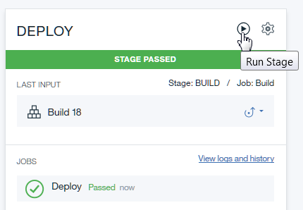
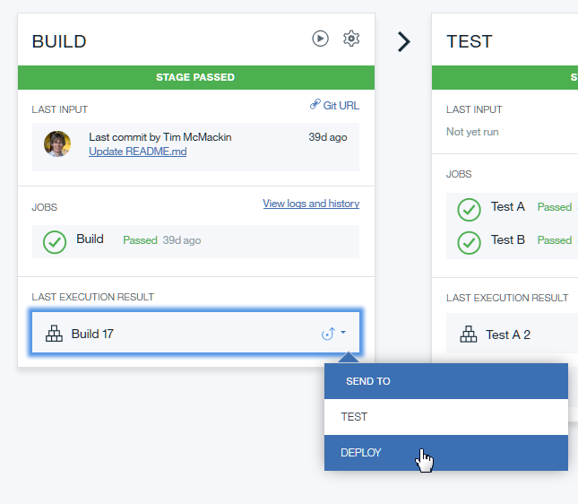

---

copyright:
  years: 2016, 2017
lastupdated: "2017-6-1"
---
<!-- Copyright info at top of file: REQUIRED
    The copyright info is YAML content that must occur at the top of the MD file, before attributes are listed.
    It must be surrounded by 3 dashes.
    The value "years" can contain just one year or a two years separated by a comma. (years: 2014, 2016)
    Indentation as per the previous template must be preserved.
-->

{:new_window: target="_blank"}
{:shortdesc: .shortdesc}
{:screen:.screen}
{:codeblock:.codeblock}

# 构建和部署
{: #deliverypipeline_build_deploy}

使用 IBM&reg; Bluemix&reg; {{site.data.keyword.deliverypipeline}} 服务，可以实现可重复的持续集成和持续交付过程。
{:shortdesc}

完成以下任务，以创建和配置管道。

## 添加阶段
{: #deliverypipeline_add_stage}

1. 在“管道”页面中，单击**添加阶段**。此时将打开“阶段配置”页面。
2. 配置阶段。
  1. 在**输入**选项卡上，选择阶段的输入。
  2. 在**作业**选项卡上，至少添加和配置一个作业。第一个阶段通常至少具有一个构建作业。
3. 单击**保存**。

## 将作业添加到阶段
{: #deliverypipeline_add_job}

1. 在阶段上，单击**阶段配置**图标，然后单击**配置阶段**。
2. 单击**作业**选项卡。
3. 单击**添加作业**。选择要添加的作业类型。
4. 配置作业。
5. 单击**保存**。

## 运行阶段
{: #deliverypipeline_run_stage}

您可以通过单击“管道”页面上的**运行阶段**图标来手动运行阶段。

您还可以从构建历史记录页面通过以下两种方式之一来请求随需应变构建和部署：
* 将构建拖动到已配置阶段下的框中。
* 在“上次执行结果”部分中，单击**发送到**图标，然后选择要部署到的空间。

要取消正在运行的阶段，请在该阶段上单击**查看日志和历史记录**。在作业列表中，单击正在运行的作业号，然后单击**取消**。您还可以通过单击作业，再单击**取消**，或单击其阶段上作业的**停止**图标，单独取消作业。

## 部署应用程序
{: #deliverypipeline_deploy}

如果正确配置了部署作业，那么只要运行该作业，就可以将应用程序部署到目标。要手动运行部署作业，请单击作业所在阶段的**运行阶段**图标。

###输入修订版
在手动运行某阶段时，或者在因为前一阶段完成而开始运行某阶段时，正在运行的阶段会选择其输入修订版。通常，输入修订版是构建号。要选择输入修订版，阶段应符合以下条件：

* 如果选择特定修订版，那么使用该修订版。
* 如果未指定特定修订版，那么搜索之前的阶段直至找到使用相同输入的阶段。查找并使用该输入上次成功运行的修订版。
* 如果未指定特定修订版且没有其他阶段使用指定的源作为输入，那么使用该输入的最新修订版。

**提示：**您可以部署之前的构建。在包含该构建的阶段上，单击**查看日志和历史记录**。在打开的页面上，单击以展开运行号，然后单击构建作业。单击**发送到**，然后选择目标。

###将服务添加到应用程序
您可以通过 Bluemix“仪表板”或 Cloud Foundry 命令行界面 (CLI)，将服务添加到应用程序，并管理这些服务。您还可以在管道作业的脚本中，发出 Cloud Foundry CLI 命令。例如，您可以在部署作业的脚本中，将服务添加到应用程序。有关添加服务的更多信息，请参阅[将服务添加到应用程序](/docs/services/reqnsi.html#add_service)。

## 查看日志
{: #deliverypipeline_view_logs}

您可以查看作业的日志，并在阶段正在运行时，在“阶段历史记录”页面上查看阶段。

要查看作业日志，请单击作业。或者在阶段上，单击**查看日志和历史记录**。

要查看已部署应用程序的运行时日志，请单击**查看运行时日志**。

除了作业日志之外，您还可以查看任何构建作业的单元测试结果、生成的工件和代码更改。

您还可以通过“阶段历史记录”页面，运行、取消或配置阶段。单击**运行**以运行阶段，或单击**配置**以配置阶段。阶段运行时，您可以通过单击运行号然后单击**取消**以取消阶段。
