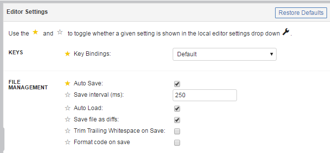

---

copyright:
  years: 2015, 2017
lastupdated: "2017-6-9"

---

{:new_window: target="_blank"}
{:shortdesc: .shortdesc}
{:screen:.screen}
{:codeblock:.codeblock}
{:pre: .pre}

# 使用 Eclipse Orion Web IDE 进行开发
{: #web_ide}

Eclipse Orion {{site.data.keyword.webide}} 是基于浏览器的开发环境，可在其中针对 Web 进行开发。您可以借助内容辅助、代码完成和错误检查功能，在 JavaScript、HTML 和 CSS 中进行开发。{{site.data.keyword.webide}} 使用几乎任何语言并为大部分文件类型提供语法突出显示。源代码控制功能内置其中，因此您可以在本地部署代码并调试应用程序。
{:shortdesc}

最重要的是，{{site.data.keyword.webide}} 由 Web 提供支持。您无需进行任何安装、维护和扩展。您可以在具有因特网连接的任何地方进行开发。

## 设置 IDE
{: #editorsetup}

{{site.data.keyword.webide}} 可进行定制，因此您可以选择满足开发需要的颜色方案、技术工具和设置。要查看和修改设置，请从左侧菜单中，单击**设置**图标 。

如果在编辑时经常需要更改某些设置，可以从**本地编辑器设置**图标快速访问这些设置。


缺省情况下，始终显示编辑器样式和字体大小的设置。要在菜单中包含其他编辑器设置，请遵循以下步骤：

1. 单击**本地编辑器设置**图标 。

2. 单击**编辑器设置**。

3. 要在**本地编辑器设置**菜单中包含或排除某个设置，请单击每个设置的星号。




## 编辑代码
{: #editcode}

{{site.data.keyword.webide}} 包含两个主要部分。第一部分是文件导航器，以树状结构显示您的项目文件。在文件导航器中，可以创建、重命名、删除以及管理文件和文件夹。

**提示：**要将文件上传到文件导航器中，请将文件从您的计算机拖动到文件导航器中。

第二部分是编辑器窗格。编辑器提供多种编码功能，包括内容辅助和语法验证。


### 使用多个文件
1. 要同时使用两个文件，请单击**更改拆分编辑器模式**图标 。
2. 从打开的菜单中选择视图。

 选择视图之后，如果一个文件已在编辑器中打开，那么该文件将显示在两个编辑器视图中。

 要打开或更改其中一个编辑器视图中显示的文件，请执行以下操作：
 1. 将光标移至您要更改的编辑器视图中。
 2. 在文件导航器中，单击该文件。

### 键盘快捷键
{{site.data.keyword.webide}} 中的许多命令可通过键盘快捷键访问。

要查看编辑器中的键盘快捷键列表，请单击**工具** > **显示键**。或者，您可以通过按 Alt+Shift+？或在 MacOS 上按 Ctrl+Shift+？来查看该列表。可以通过将鼠标悬停在键上、单击画笔并输入新的键绑定来定制快捷键。

## 管理源代码
{: #sourcecontrol}

{{site.data.keyword.webide}} 与源代码管理工具相集成。要使用 Git 存储库，请单击 **Git 存储库**图标 。

 **提示**：如果您使用 {{site.data.keyword.webide}} 与开放式工具链，那么您的工作空间会预先填入 GitHub、{{site.data.keyword.ghe_short}} 或 Git Repos and Issue Tracking 存储库。与您当前工具链相关联的存储库会突出显示。


## 从您的工作空间部署应用程序
{: #deploy}

1. 要部署应用程序，请从运行栏选择或创建启动配置。   
1. 单击“部署”图标 。这时将使用工作空间的当前内容以及启动配置中定义的环境来部署应用程序的实例。
2. 应用程序部署完成后，可使用运行栏停止、重新启动或调试应用程序，以及查看日志等等。


<table>
<tr><td></td><td>停止应用程序</td></tr>
<tr><td> </td><td> 打开已部署的应用程序</td></tr>
<tr><td></td><td>查看已部署应用程序的日志</td></tr>
<tr><td></td><td>打开应用程序的仪表板</td></tr>
</table>

如果您是在开发 Node.js 应用程序，请启用“实时编辑”方式：

<table><tr><td></td><td>在启用“实时编辑”方式的情况下，快速重新启动应用程序而不重新部署。</td></tr>
<tr><td> </td>
<td>在启用“实时编辑”方式的情况下访问调试器</td></tr>
</table>

<!-- 3/6/2016: bl commands don't work with V2/CD
## Editing outside of the {{site.data.keyword.webide}}
{: #editlocal}

To use an editor besides the {{site.data.keyword.webide}}, set up {{site.data.keyword.Bluemix_live}} so that you can work directly with your project files in any tool. {{site.data.keyword.Bluemix_live_notm}} is a command-line application that synchronizes the changes in your local file system with your cloud workspace in {{site.data.keyword.jazzhub}}.

### Before you begin

Download and install the [{{site.data.keyword.Bluemix_live_notm}} command-line interface ](http://livesyncdownload.ng.bluemix.net){: new_window}.

### Synchronizing your local environment with {{site.data.keyword.Bluemix_notm}}
{: #edit_local_download}

1. Open a command-line window.
2. Sign in to {{site.data.keyword.Bluemix_notm}}:

	```
	bl login
	```
	{: pre}

3. When you are prompted, enter your IBMid and password.
4. View a list of your {{site.data.keyword.Bluemix_notm}} projects:

	```
	bl projects
	```
	{: pre}

4. Synchronize your local environment with your project on {{site.data.keyword.Bluemix_notm}}:

	```
	bl sync projectName
	```
	{: pre}

where `projectName` is your {{site.data.keyword.Bluemix_notm}} app's name.

When you are finished editing, enter `q` to end synchronization.

### Enabling the Desktop Sync feature to edit code locally

The Desktop Sync feature is like Live Edit mode for the command line. You need the Desktop Sync feature to debug on the command line.
1. In another command-line window, enable the Desktop Sync feature:

	```
	cd localDirectory
	bl start
	```
	{: codeblock}

2. Use the launch configuration that you created in the {{site.data.keyword.webide}}. After you select the launch configuration, the Desktop Sync feature is enabled in your local environment. In the command-line window that you just opened, you can view the app's URL, the debug URL, the manage URL, and view the {{site.data.keyword.Bluemix_live_notm}} state.

3. Refresh the browser and verify that you can see the changes that you saved to static files in the local workspace.

### Disabling the Desktop Sync feature

1. In the second command-line window, enter `bl stop`.
2. In the first command-line window, enter `q`.

-->

## 受支持的语言
{: #supported_languages}

Eclipse Orion {{site.data.keyword.webide}} 为 JavaScript、HTML、CSS 和 Markdown 文件提供内容辅助、工具提示、预览、验证和语法突出显示。以下文件类型也支持语法突出显示：

<table>
<tr>
<td>
<ul><li>Arduino
</li><li>C</li>
<li>C#
</li><li>C++
</li><li>CoffeeScript
</li><li>CSHTML
</li><li>嵌入式 JavaScript (ejs)
</li><li>Erlang
</li><li>Go
</li><li>HTML 抽象标记语言 (Haml)
</li><li>Jade
</li><li>Java
</li><li>JSON
</li><li>Less  
</li><li>Lua  
</li><li>Objective-C
</li><li>PHP
</li><li>Python</li></ul>
</td>
<td>
<ul><li>Ruby
</li><li>Sass/SCSS
</li><li>SQL
</li><li>Swift
</li><li>TypeScript
</li><li>Visual Basic (vb)
</li><li>VMHTML
</li><li>XHTML
</li><li>XML
</li><li>XQuery
</li><li>YAML
</li><li>启动文件
</li><li>Dockerfile
</li><li>gitignore
</li><li>git config
</li><li>cfignore
</li><li>properties
</li></ul>
</td>
</tr>
</table>

## 学习教程：Eclipse Orion Web IDE
{: #toolchain_tutorials}

查阅 [IBM&reg; Cloud Garage Method ](https://www.ibm.com/devops/method){:new_window} 上的下列某个教程：
  * [创建并使用第一个工具链 (GitHub) ](https://www.ibm.com/devops/method/tutorials/tutorial_toolchain_flow?task=1){:new_window}
  * [创建使用 Git Repos and Issue Tracking 的工具链 ](https://www.ibm.com/devops/method/tutorials/tutorial_toolchain_cfv2?task=1){:new_window}
  * [创建并使用具有 DevOps Insights 的微服务工具链 (V2) ](https://www.ibm.com/devops/method/tutorials/tutorial_toolchain_microservices_cd?task=1){:new_window}
