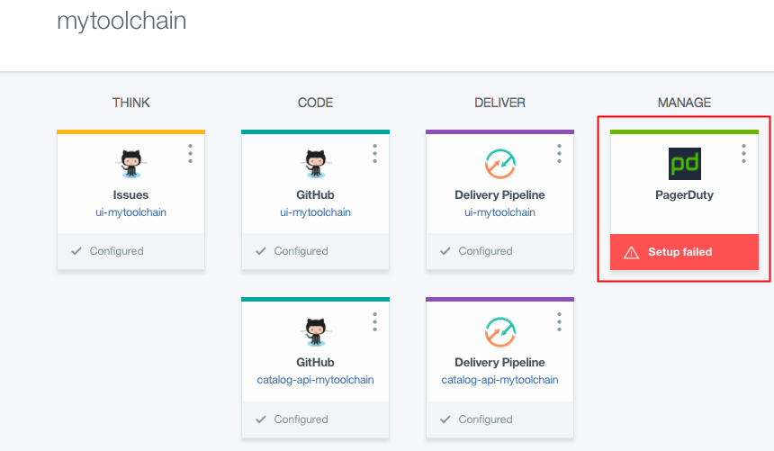

---

copyright:
  years: 2015, 2017
lastupdated: "2017-5-25"

---
<!-- Common attributes used in the template are defined as follows: -->
{:tsSymptoms: .tsSymptoms}
{:tsCauses: .tsCauses}
{:tsResolve: .tsResolve}
{:new_window: target="_blank"}
{:shortdesc: .shortdesc}

# {{site.data.keyword.contdelivery_short}} 疑難排解
{: #ts_cd}

取得使用 {{site.data.keyword.contdelivery_full}} 之一般疑難排解問題的答案。
{:shortdesc}


## 無法授權使用 GitHub
{: #cannot_authorize_github}

您未獲授權使用 GitHub。
{:shortdesc}

如果 {{site.data.keyword.Bluemix_notm}} 未獲授權存取 GitHub 帳戶，則可能會發生下列任何問題：
{: tsSymptoms}

 * 當您嘗試將 GitHub 工具整合新增至工具鏈時，未新增工具整合。
 * 當您將變更推送至 GitHub 或 GitHub Enterprise 儲存庫時，未自動執行管線。

{{site.data.keyword.Bluemix_notm}} 未獲授權存取 GitHub。  
{: tsCauses}

如果您要在建立工具鏈時配置 GitHub 工具整合，請遵循下列步驟：
{: tsResolve}

  1. 在「可配置的整合」區段中，按一下 **GitHub**。
  1. 如果您要在「{{site.data.keyword.Bluemix_notm}} 公用」上建立工具鏈，但未授權 {{site.data.keyword.Bluemix_notm}} 存取 GitHub，請按一下**授權**來移至 GitHub 網站。
  1. 如果您沒有作用中的 GitHub 階段作業，則系統會提示您登入。按一下**授權應用程式**，以容許 {{site.data.keyword.Bluemix_notm}} 存取 GitHub 帳戶。

如果您已有工具鏈，請更新 GitHub 工具整合的配置：

 1. 在 DevOps 儀表板的**工具鏈**頁面上，按一下工具鏈來開啟其「概觀」頁面。或者，在應用程式之「概觀」頁面的「持續交付」卡片上，按一下**檢視工具鏈**，然後按一下**概觀**。
 1. 在 GitHub 卡片上，按一下功能表，然後按一下**配置**。
 1. 更新配置設定，以授權 {{site.data.keyword.Bluemix_notm}} 存取 GitHub。按一下**授權**，以移至 GitHub 網站。如果您沒有作用中的 GitHub 階段作業，則系統會提示您登入。按一下**授權應用程式**，以容許 {{site.data.keyword.Bluemix_notm}} 存取 GitHub 帳戶。
 1. 完成設定的更新後，請按一下**儲存整合**。


## 無法建立工具鏈
{: #cannot_create_toolchain}

建立工具鏈時會顯示錯誤。
{:shortdesc}

當您建立工具鏈，您會看到下列錯誤訊息：
{: tsSymptoms}

`This organization contains 200 toolchains, which is the maximum limit. Before you can add another toolchain, remove one or more toolchains from the organization.`

組織 (org) 中的工具鏈不得超過 200 個。  
{: tsCauses}

從組織移除一個以上的工具鏈，然後重新建立工具鏈。
{: tsResolve}


## 已超出組織的記憶體限制
{: #org_outofmemory}

如果您超出組織的記憶體限制，則可能無法將應用程式部署至 {{site.data.keyword.Bluemix_notm}}。您可以減少應用程式所使用的記憶體，或增加帳戶的記憶體配額。試用帳戶的記憶體配額上限為 2 GB。
當您升級至付費帳戶時，可以增加配額。

將應用程式部署至 {{site.data.keyword.Bluemix_notm}} 時，您看到下列錯誤訊息：
{: tsSymptoms}

`FAILED Server error, status code: 400, error code: 100005, message: You have exceeded your organization's memory limit.`

當組織剩餘的記憶體量少於您想要部署之應用程式所需的記憶體量時，就會發生這個錯誤。試用帳戶的記憶體配額上限為 2 GB。
{: tsCauses}

您可以增加帳戶的記憶體配額，或減少應用程式所使用的記憶體。
{: tsResolve}

  * 若要增加帳戶的記憶體配額，請將試用帳戶轉換為付費帳戶。如需如何將試用帳戶轉換成付費帳戶的相關資訊，請參閱[付費帳戶](/docs/pricing/index.html#pay-accounts)。
  * 若要減少應用程式所使用的記憶體，請使用 {{site.data.keyword.Bluemix_notm}} 主控台或 cf 指令行介面。

    如果您使用 {{site.data.keyword.Bluemix_notm}} 主控台，請完成下列步驟：

    1. 在應用程式儀表板中，選取您的應用程式。即會開啟應用程式詳細資料頁面。
    2. 在「運行環境」窗格中，您可以針對您的應用程式減少記憶體上限及（或）應用程式實例的數目。

    如果您使用 cf 指令行介面，請完成下列步驟：

    1. 檢查有多少記憶體用於應用程式：

	  ```
	  cf apps
	  ```

	  cf apps 指令會列出您在現行空間中部署的所有應用程式。也會顯示每個一應用程式的狀態。

    2. 若要減少應用程式所使用的記憶體量，請減少應用程式實例的數目及（或）記憶體上限：

	  ```
	  cf push appname -p app_path -i instance_number -m memory_limit
      ```

    3. 重新啟動應用程式，讓變更生效。

如需管理應用程式的一般問題的相關資訊，請參閱[管理應用程式疑難排解](https://console.bluemix.net/docs/troubleshoot/ts_apps.html#managingapps)。


## 執行列不會在 Eclipse Orion Web IDE 中顯示 Bluemix Live Sync 圖示
{: #ts_llz_lkb_3r}

您已建立應用程式，但 IBM Bluemix Live Sync 圖示未顯示在 Eclipse Orion Web IDE 執行列中。您看不到含有「即時編輯」圖示的完整執行列：

   

當您在 Web IDE 中編輯 Node.js 應用程式時，{{site.data.keyword.Bluemix_notm}} 即時編輯、快速重新啟動及除錯圖示都未顯示在執行列中。
{: tsSymptoms}

在下列情況下，無法使用這些圖示：
{: tsCauses}

* `manifest.yml` 檔案未儲存在專案的最上層。
* 您的應用程式儲存在子目錄中，而非根目錄中，但 `manifest.yml` 檔案中未指定該子目錄的路徑。
* 應用程式未包含 `package.json` 檔案。

請使用下列其中一個方法：
{: tsResolve}

* 如果 `manifest.yml` 檔案未儲存在根目錄中，請將它儲存在該處。
* 如果應用程式儲存在子目錄中，請在 `manifest.yml` 檔案中指定該子目錄的路徑。
   ```
    path: path_to_application
    ```
* 在與應用程式相同的目錄中建立 `package.json` 檔案。


## 未載入工具鏈
{: #toolchains_load}

當您按一下工具鏈以檢視其「概觀」頁面時，未載入工具鏈。
{:shortdesc}

在 DevOps 儀表板的**工具鏈**頁面上，按一下工具鏈來開啟其「概觀」頁面。或者，在應用程式之「概觀」頁面的「持續交付」卡片上，按一下**檢視工具鏈**。然後，按一下**概觀**。工具鏈的「概觀」頁面未開啟。
{: tsSymptoms}

請檢查 {{site.data.keyword.Bluemix_notm}} 狀態，以查看問題是否因中斷而起。
{: tsCauses}

請檢視「{{site.data.keyword.Bluemix_notm}} 狀態」頁面，以確定是否有已知問題影響 {{site.data.keyword.Bluemix_notm}} 平台及 {{site.data.keyword.Bluemix_notm}} 中的主要服務。
{: tsResolve}

您可以選擇下列其中一個選項來尋找「狀態」頁面：

  * 登入 {{site.data.keyword.Bluemix_notm}} 主控台。從功能表列中，按一下**支援**，然後選取**狀態**。請檢查針對  圖示列出的資源。此圖示可能指出運作中斷。
  * 直接在 [IBM {{site.data.keyword.Bluemix_notm}} - 系統狀態 ](http://ibm.biz/bluemixstatus){: new_window} 存取它。

如需「{{site.data.keyword.Bluemix_notm}} 狀態」頁面的相關資訊，請參閱 [Viewing {{site.data.keyword.Bluemix_notm}} status](https://console.bluemix.net/docs/support/index.html#viewing-bluemix-status)。


## 未配置工具整合
{: #tool_integration_error}

配置工具鏈的工具整合之後，其工具卡片上顯示 `Setup failed` 錯誤。
{:shortdesc}

配置工具整合之後，您檢視其在工具鏈之「概觀」頁面上的工具卡片，並注意到設定失敗。
{: tsSymptoms}

 

新增工具整合時，工具鏈會與工具整合所代表的工具進行通訊，來佈建任何必要資源，以及建立它們與工具鏈的關聯。如果在設定處理程序期間發生錯誤，或工具鏈與工具之間的通訊未適當地完成，則工具整合會進入錯誤狀態。
{: tsCauses}

重新配置工具整合：
{: tsResolve}

1. 在其工具卡片上，將游標移至 `Setup failed` 訊息上方，然後按一下**重新配置**。

 

1. 確定您使用的是有效的配置參數。如果是無效的配置導致錯誤，則會顯示錯誤訊息；例如，`The integration could not be set up. Check the settings and try again. Reason: Invalid api_key:fakeKey`。更新工具整合的設定，然後按一下**儲存整合**。
1. 如果是通訊問題導致錯誤，請按一下**儲存整合**以重試。


<!-- ## Pipeline job failures
{: #cannot_authorize_github}

A pipeline job failed.
{:shortdesc}

Your pipeline job failed.
{: tsSymptoms}

 * Some reasons

Many reasons  
{: tsCauses}

If you are configuring the GitHub tool integration while you are creating your toolchain, follow these steps:
{: tsResolve}

  1. In the Configurable Integrations section, click **GitHub**.
  1. If you are creating the toolchain on {{site.data.keyword.Bluemix_notm}} Public and you have not authorized {{site.data.keyword.Bluemix_notm}} to access GitHub, click **Authorize** to go to the GitHub website.
  1. If you don't have an active GitHub session, you are prompted to log in. Click **Authorize Application** to allow {{site.data.keyword.Bluemix_notm}} to access your GitHub account. If you have an active GitHub session but you haven't entered your password recently, you might be prompted to enter your GitHub password to confirm.

If you already have a toolchain, update the GitHub tool integration's configuration:

 1. On the DevOps dashboard, on the **Toolchains** page, click the toolchain to open its Overview page. Alternatively, on the app's Overview page, on the Continuous delivery card, click **View Toolchain**, and then click **Overview**.
 1. On the GitHub card, click the menu and click **Configure**.
 1. Update the configuration settings to authorize {{site.data.keyword.Bluemix_notm}} to access GitHub. Click **Authorize** to go to the GitHub website. If you don't have an active GitHub session, you are prompted to log in. Click **Authorize Application** to allow {{site.data.keyword.Bluemix_notm}} to access your GitHub account. If you have an active GitHub session but you haven't entered your password recently, you might be prompted to enter your GitHub password to confirm.
 1. When you are finished updating the settings, click **Save Integration**.  -->


<!-- This is the template for a problem topic.  -->

<!-- The short description section contains a brief description of problem. For example:  

After you create an app on the Dashboard, you click *ADD GIT* to create a Git repository, but you cannot proceed.
{:shortdesc} -->

<!-- The symptoms section contains a description of problem symptoms. For example:  
When you click ADD GIT, a window opens and one of these issues occur:
- The window hangs with a blank screen.
- A message states that a problem exists with 3rd party cookies.
{: tsSymptoms} -->

<!-- The causes section contains a brief explanation of what causes the problem. For example:  
Your browser might be configured to prevent a cookie from being set. That cookie must be set from the IBM Bluemix DevOps Services site in the hub.jazz.net internet domain from within the context of the Bluemix console.
{: tsCauses} -->

<!-- The resolve section contains steps to resolve the problem. For example:  
You can fix this problem in one of three ways:
- Follow the instructions that are in the window that opens from the Bluemix console. Click the button. Another browser window opens temporarily. In that window, DevOps Services sets the authentication cookie.
- In another browser tab, go to https://hub.jazz.net and log in. Return to the Bluemix console and refresh the page. Click ADD GIT again.
- Change your browser settings to enable 3rd party cookies and click ADD GIT again.
{: tsResolve} -->
