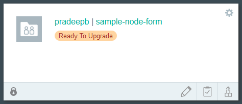
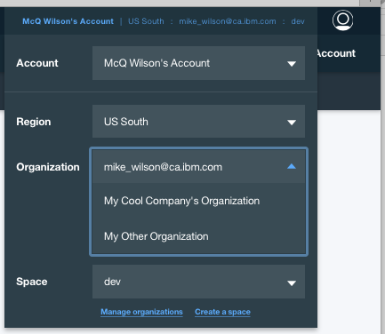
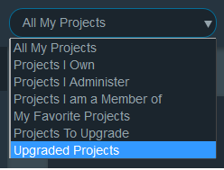

---

copyright:
  years: 2015, 2017
lastupdated: "2017-7-24"

---

{:shortdesc: .shortdesc}
{:new_window: target="_blank"}

# 將 {{site.data.keyword.jazzhub_short}} 專案升級至工具鏈
{: #upgrade_projects}

{{site.data.keyword.jazzhub}} 將會逐漸發展成 {{site.data.keyword.contdelivery_full}}。進行該變更時，會將專案升級至工具鏈。

您可以升級專案，或等待它自動升級。若要獲得最佳經驗，請確定您符合[必要條件](#upgrade_prereqs)，並盡快升級專案，以控制工具鏈的名稱，以及在其中建立它的組織。
{: shortdesc}

**常見問題集**

- [我的 JazzHub 專案與 UK 地區相關聯，但我的工具鏈將會在美國南部地區。這樣會如何運作？](#faq_region)
- [當我升級時，Track &amp; Plan 中的工作項目和儀表板會發生什麼事？](#faq_tp)
- [當我升級時，我的程式碼儲存庫會發生什麼事？](#faq_repo)
- [當我升級至工具鏈時，我專案中的建置定義會發生什麼事？](#faq_build)
- [我需要為將升級至工具鏈的專案建立組織。我瞭解我需要先新增信用卡到我的帳戶中，才能建立組織。我的信用卡會被收費嗎？](#faq_charges)
- [我找不到或無法存取工具鏈。我該怎麼辦？](#faq_find)
- [我的專案與英國地區相關聯。升級之後，我看到錯誤訊息、我的同事無法存取工具鏈，而且我在 Bluemix 的「工具鏈」頁面上看不到工具鏈。這是怎麼回事？](#faq_uk)

## 工具鏈
{: #compare_toolchains}

工具鏈就像專案，但有一些重要差異：

- 專案只能有一個儲存庫及管線。視需要，工具鏈可以有任意數目的儲存庫及管線。
- 工具鏈可以包含專案中無法使用的工具（例如 Slack、Sauce Labs、PagerDuty 及 {{site.data.keyword.DRA_full}}）。
- 工具鏈的存取權是透過標準 {{site.data.keyword.Bluemix_notm}} 組織進行管理。與專案不同，成員資格是在組織層次進行維護，而在專案中，成員資格是在專案層次進行維護。

您可以在 [YouTube ](https://youtu.be/2SIPE1e7NJ4){: new_window} 或[開始使用 {{site.data.keyword.contdelivery_short}}](/docs/services/ContinuousDelivery/index.html) {: new_window} 中瞭解工具鏈。

## 必要條件
{: #upgrade_prereqs}

- 若要存取已升級專案的工具鏈，您需要 {{site.data.keyword.Bluemix_notm}} ID。升級之前，您必須驗證您有作用中的 {{site.data.keyword.Bluemix_notm}} ID。如果您沒有，請[註冊](https://console.ng.bluemix.net/registration/)。
- 確定 {{site.data.keyword.jazzhub_short}} 專案擁有者正確無誤。從您專案建立的工具鏈將是該擁有者之 {{site.data.keyword.Bluemix_notm}} 組織的一部分。
- 確定您要建立工具鏈的組織及空間位在美國南部地區的「{{site.data.keyword.Bluemix_notm}} 公用」上。若要確認您具有美國南部的有效組織及空間，請登入 [https://console.bluemix.net/devops/toolchains?env_id=ibm:yp:us-south ](https://console.bluemix.net/devops/toolchains?env_id=ibm:yp:us-south){: new_window}，並在系統提示時建立一個空間。
- 如果您規劃開始升級，請確定您是每個在其中部署管線的組織及空間的成員。任何專案管理者都可以開始升級。不過，如果開始升級的管理者不是每個在其中部署管線的組織及空間的成員，則無法建立管線。開始升級的人員會變成工具鏈中儲存庫的擁有者。
- 工具鏈中的 Eclipse Orion {{site.data.keyword.webide}} 不同於與專案相關聯的 {{site.data.keyword.webide}}。如果您使用 {{site.data.keyword.webide}}，而且有未確定的變更，請先確定它們，再進行升級。

## 從專案升級至工具鏈
{: #project_to_toolchain}

**重要事項：**hub.jazz.net 及工具鏈中的專案都是在美國南部地區進行管理。如果您的專案已配置成將應用程式部署至不同地區，則在將專案升級至工具鏈之後，仍會將應用程式部署至該地區。

準備好升級專案時，會在專案的卡片及「概觀」頁面上顯示一則訊息。

**提示：**您可以從「我的專案」頁面的功能表中找到準備好升級的專案：

開始升級時，會鎖定您專案中的管線階段。您將無法執行或修改它們。如果您刪除工具鏈來回復升級，則會將管線解除鎖定。

如果您的專案使用在 JazzHub 上管理的 Git 儲存庫，則在開始升級之後，會鎖定儲存庫，確保移至工具鏈的資料的完整性。如果您刪除工具鏈來回復升級，則會將 JazzHub 上的儲存庫解除鎖定。

如需升級過程中，各種儲存庫處理方式的完整詳細資料，請參閱下表。

|專案儲存庫|專案類型	|工具鏈儲存庫|
|:----------|:------------------------------|:------------------|
|github.com 		|專用或公用|具有「{{site.data.keyword.Bluemix_notm}} 公用」的相同 github.com 儲存庫。|
|hub.jazz.net/git		|專用或公用|{{site.data.keyword.gitrepos}} 中具有「{{site.data.keyword.Bluemix_notm}} 公用」的新儲存庫。|
{: caption="表 1. 對映至工具鏈儲存庫的專案儲存庫" caption-side="top"}

## 開始升級處理程序
{: #start_upgrade}

您可以先在 [YouTube ](https://youtu.be/LSr2e3uvyLs){: new_window} 上觀看作用中的升級處理程序，然後再開始升級處理程序。{: new_window}

若要將專案升級至工具鏈，請遵循下列步驟：

1. 若要開始升級處理程序，請按一下橫幅訊息上的**立即升級**。即會開啟「專案升級工具鏈」頁面。

   

   如需升級處理程序的概觀，請閱讀該頁面上的說明。此工具鏈會包含新的管線，而這個管線包含與專案管線相同的階段及工作。此外，此工具鏈將包含 {{site.data.keyword.contdelivery_short}} 中所執行 Eclipse Orion {{site.data.keyword.webide}} 的指標。

   在此範例中，因為專案使用 github.com 上的公用儲存庫，所以工具鏈將會連接至相同的 GitHub 儲存庫。如果您的專案使用在 JazzHub 上管理的 Git 儲存庫，則該儲存庫的內容將會複製到 {{site.data.keyword.gitrepos}}（這是 {{site.data.keyword.contdelivery_short}} 的一部分）中的新儲存庫。

2. 若要自訂工具鏈，您可以配置一些設定：

   - 若要變更工具鏈的名稱，請編輯**名稱**欄位。

      

   - 若要變更在其中建立工具鏈的 {{site.data.keyword.Bluemix_notm}} 組織，請從帳戶功能表中選取組織：

      

   因為工具鏈是在組織層次進行管理，所以請一定要選取已經有或可新增需要存取此工具鏈之專案成員的組織。

3. 如果您已在專案中使用「追蹤及計劃」，則可以將「追蹤及計劃」資料傳送至 GitHub Issues。

   

   - 指出是否要移轉「追蹤及計劃」資料。
   - 預設會移轉所有「追蹤及計劃」資料。如果您偏好只移轉屬於特定查詢一部分的工作項目，請指定該查詢。
   - 選取您要對映至 GitHub Issues 中標籤的任何工作項目屬性。

4. 按一下**建立**。即會建立新的工具鏈，並顯示其「概觀」頁面。

   

   - 若要存取 GitHub 儲存庫或相關聯的問題追蹤器，請按一下 **GitHub** 或 **Issues**。
   - 若要存取管線，請按一下 **Delivery Pipeline**。
   - 若要存取包含已移出至工作區之儲存庫內容的 {{site.data.keyword.webide}}，請按一下 **Eclipse Orion {{site.data.keyword.webide}}**。

   如果您在升級期間回到專案，則橫幅訊息可能會指出正在升級，特別是升級程序包含將原始碼匯入至新儲存庫時，或將「追蹤及計劃」工作項目匯入為問題時。

   

## 重新造訪專案
{: #revisit_projects}

您已經準備好使用新的工具鏈。您的專案現在會標示為「已升級」，並且會在「概觀」頁面上顯示確認訊息。

您可以從「我的專案」頁面的功能表中選取**已升級的專案**，來查看哪些專案已完成升級：

如果您需要回復升級，請刪除工具鏈。您可以從工具鏈「概觀」頁面的**其他動作**功能表中刪除工具鏈：

當您回到專案時，會再次顯示升級訊息，而您可以在準備好時重新升級。

## 後續步驟
{: #upgrade_next_steps}

1. 重新整理瀏覽器，並檢查專案「概觀」頁面上您的專案「已升級至此工具鏈」的訊息，確認升級已完成：

   

   **附註：**如果訊息指出「立即升級」，則升級失敗。按一下**立即升級**鏈結，再試一次。

   

2. 將工具鏈的存取權授與團隊成員。
    - 每一個團隊成員都必須具有有效的 {{site.data.keyword.Bluemix_notm}} 帳戶。沒有帳戶的團隊成員必須進行[註冊 ](https://console.ng.bluemix.net/registration){:new_window}。
    - 從工具鏈「管理」頁面中，將工具鏈存取權授與組織成員。在升級處理程序中，會將現有專案成員新增為工具鏈成員。如需工具鏈存取控制的相關資訊，請參閱[管理存取權 ](/docs/services/ContinuousDelivery/toolchains_using.html#managing_access){:new_window}。
    - 如果使用者不是工具鏈所屬組織的成員，請從「管理組織」頁面中將他們新增至組織。
    - 如果您的工具鏈使用 {{site.data.keyword.gitrepos}}，則會將所有具有有效 Bluemix ID 的 JazzHub 專案成員新增至 {{site.data.keyword.gitrepos}} 儲存庫，而他們對此儲存庫的專用權與在 JazzHub 專案中相同。如果您的 JazzHub 專案包括沒有有效 Bluemix ID 的成員，則他們可以登錄一個，並將其新增至儲存庫。
      如需管理組織的相關資訊，請參閱[管理組織及空間 ](/docs/admin/orgs_spaces.html#orgsspacesusers){:new_window}。

3. 使用工具鏈中的工具，而不是 {{site.data.keyword.jazzhub_short}} 專案中的工具。例如，若要從瀏覽器編輯程式碼，請使用工具鏈中的 Web IDE。

4. 如果您使用的是 {{site.data.keyword.gitrepos}}，請使用個人存取記號或 SSH 金鑰進行鑑別。如需 SSH 金鑰的相關資訊，請參閱[建立個人存取記號或 SSH 金鑰來進行鑑別](/docs/services/ContinuousDelivery/git_working.html#git_authentication)。若要從外部 Git 用戶端透過 https 進行鑑別，請遵循下列步驟：
    1. 移至 {{site.data.keyword.gitrepos}} 使用者設定的[存取記號頁面 ](https://git.ng.bluemix.net/profile/personal_access_tokens){:new_window}。
    2. 建立使用 **api** 作為範圍的個人存取記號。
    3. 移至[帳戶頁面 ](https://git.ng.bluemix.net/profile/account){:new_window}，並針對 {{site.data.keyword.gitrepos}} 尋找您的使用者名稱。您的使用者名稱會列在「變更使用者名稱」區段中，並顯示為任何您建立的個人儲存庫的 URL 的第一個部分。
    4. 若要從外部 Git 用戶端透過 https 向 {{site.data.keyword.gitrepos}} 進行鑑別，請使用您的使用者名稱及個人存取記號。
    5. 如果您要重複使用 JazzHub Git 儲存庫的本端儲存庫，請將儲存庫指向 {{site.data.keyword.gitrepos}} 中的新儲存庫。從終端機的 Shell 中，切換至在其中複製 JazzHub Git 儲存庫的目錄。輸入 `git remote set-url` 指令：`git remote set-url origin https://git.ng.bluemix.net/<userid>/<name-of-new-repo>`

        **提示：**若要檢查哪些遠端 URL 設為哪些遠端名稱，請使用 `git remote -v` 指令。預設遠端名稱是 `origin`。如果您有更進階的安裝，則指令的形式如下：`git remote set-url <remote-name-that-uses-jazzhub-repo> https://git.ng.bluemix.net/<userid>/<name-of-new-repo>`

5. 若已設定工具鏈，並且開始使用工具鏈，請考慮採取所有這些步驟或其中任何步驟，以確保沒有人使用您的專案：
    - 新增專案名稱的字尾，指出不得使用它。您可以在專案名稱尾端新增 `_DO_NOT_USE`。
    - 更新專案的說明以提及不再使用它，並新增工具鏈的指標。
    - 從專案中移除成員。
    - 當您不再需要此專案時，請將它刪除。

6. 選用項目：若要探索您專案的開發成熟度、團隊的作法，以及程式碼庫的品質，請將 IBM Cloud {{site.data.keyword.DRA_short}} 新增至工具鏈。{{site.data.keyword.DRA_short}} 會將開發人員、團隊及部署分析人員套用至 DevOps 專案。如需相關資訊，請參閱[開始使用 {{site.data.keyword.DRA_short}}](/docs/services/DevOpsInsights/index.html)。

## 疑難排解
{: #upgrade_troubleshoot}

如果您在升級處理程序期間發現問題，請嘗試下列其中一個以上疑難排解步驟：

- 檢查[必要條件](#upgrade_prereqs)，以確定您符合它們。具體而言，請確定您是每個在其中部署管線的組織及空間的成員。
- 如果在您第一次嘗試升級期間發生問題，而且您符合所有必要條件，請嘗試重新升級。
- 如果您的專案使用 Jazz SCM 或 IBM 所管理的 Git 進行來源控制，請檢查儲存庫的大小。如果它大於 500 MB，請[聯絡 DevOps Services 團隊 ](https://developer.ibm.com/answers/questions/ask/?smartspace=devops-services){:new_window}。
- 如果您找不到或無法存取工具鏈，請參閱[此常見問題 (FAQ) 項目](#faq_find)。
- 如果您繼續發生問題，請將問題張貼至[支援討論區 ](https://developer.ibm.com/answers/questions/ask/?smartspace=devops-services){:new_window}。在討論區貼文中，併入 {{site.data.keyword.jazzhub_short}} 專案及 {{site.data.keyword.contdelivery_short}} 工具鏈的 URL，並將貼文標上 `devops-services` 標籤。

## 常見問題集
{: #upgrade_faq}

### 我的 JazzHub 專案與 UK 地區相關聯，但我的工具鏈將會在美國南部地區。這樣會如何運作？
{: #faq_region}

hub.jazz.net 的專案和工具鏈都在美國南部地區進行管理。如果您的專案已配置成將應用程式部署至不同地區，例如 UK 地區，則在將專案升級至工具鏈之後，仍會將應用程式部署至該地區。因此，關於資料的管理所在之處其實沒有什麼改變。工具鏈未來將可在更多地區使用。

### 當我升級時，Track &amp; Plan 中的工作項目和儀表板會發生什麼事？
{: #faq_tp}

{{site.data.keyword.contdelivery_short}} 服務透過 {{site.data.keyword.gitrepos}} 提供問題追蹤功能，{{site.data.keyword.gitrepos}} 是由 IBM 管理，並且是以 GitLab Community Edition 為基礎。{{site.data.keyword.contdelivery_short}} 也支援整合其他規劃及問題追蹤工具，例如 GitHub Issues 及 JIRA。

在升級過程期間，您可以選擇將 Track &amp; Plan 工作項目移轉至 Git Issues。GitHub Issues 和 {{site.data.keyword.gitrepos}} 提供看板與問題追蹤，以便進行規劃。若要進一步瞭解 Issue Board（這是 Git Repos and Issue Tracking 中的看板特性），請參閱 [Issue Board ](https://git.ng.bluemix.net/help/user/project/issue_board.md){: new_window}。

對於需要與已淘汰之 JazzHub Track &amp; Plan 相同功能的客戶，在選定的國家或地區中有一項新的 IBM Track and Plan Cloud 服務可以依每月每位使用者單獨購買。使用這項雲端服務，您會在單一承租戶雲端訂閱中獲得完整的功能，相等於 Rational Team Concert&trade; 貢獻者授權。

這項新的 IBM Track and Plan on Cloud 服務提供的功能遠比已淘汰的 JazzHub Track &amp; Plan 更豐富，並且支援處理程序自訂作業、專案階層、SAFe&reg; 以及許多其他敏捷式和混合式方法，也提供成長超越單一專案的可擴充性。它是根據最新版本的 Rational Team Concert 6.0.3，且在未來 60 天內將為 6.0.4 版，而 JazzHub Track &amp; Plan 則是根據 Rational Team Concert 5.x。您可以透過其他服務將資料移轉到 IBM Track and Plan on Cloud。您可以與 [Tom Hollowell ](mailto:trhollow@us.ibm.com){:new_window}（Connected Products SaaS 業務主管）聯絡，以取得相關資訊。

如需 IBM Track and Plan on Cloud 的相關資訊，或是想要線上購買，請造訪 [IBM Marketplace ](https://www.ibm.com/us-en/marketplace/cloud-change-management){: new_window}。

若要額外購買 Build Automation 和 Source Code Management，可以選擇 [Rational Team Concert on Cloud ](https://www.ibm.com/us-en/marketplace/change-and-configuration-management/purchase#product-header-top){: new_window}。

### 當我升級時，我的程式碼儲存庫會發生什麼事？
{: #faq_repo}

升級之後，新的 Git 服務將類似於您先前的服務。如果您使用 github.com 搭配 JazzHub 專案，您的工具鏈將連接至相同的 GitHub 儲存庫。如果您的 JazzHub 專案使用 IBM 管理的 Git，則該儲存庫的內容將會複製到 {{site.data.keyword.gitrepos}}（這是 {{site.data.keyword.contdelivery_short}} 的一部分且由 IBM 管理）中的新儲存庫。

如需升級過程中，各種儲存庫處理方式的完整詳細資料，請參閱下表。

|專案儲存庫|專案類型	|工具鏈儲存庫|
|:----------|:------------------------------|:------------------|
|github.com 		|專用或公用|具有「{{site.data.keyword.Bluemix_notm}} 公用」的相同 github.com 儲存庫。|
|hub.jazz.net/git		|專用或公用|{{site.data.keyword.gitrepos}} 中具有「{{site.data.keyword.Bluemix_notm}} 公用」的新專用或公用儲存庫。|
{: caption="表 1. 對映至工具鏈儲存庫的專案儲存庫" caption-side="top"}

### 當我升級至工具鏈時，我專案中的建置定義會發生什麼事？
{: #faq_build}

如果您使用 Jazz 而非 Delivery Pipeline 來建置原始碼，則必須手動移轉建置定義到工具鏈中的 Delivery Pipeline。

如果您使用 Jazz SCM 作為來源儲存庫，且使用 Delivery Pipeline 建置程式碼，則 Jazz SCM 中的原始檔會自動移到 Git 儲存庫。您的 Delivery Pipeline 配置將維持相同，只除了它會使用來自 Git 儲存庫的原始檔，而不是來自 Jazz SCM 的原始檔。

### 我需要為將升級至工具鏈的專案建立組織。我瞭解我需要先新增信用卡到我的帳戶中，才能建立組織。我的信用卡會被收費嗎？
{: #faq_charges}

身為[隨收隨付制客戶 ](https://www.ibm.com/cloud-computing/bluemix/pricing){: new_window}，如果您使用超過 Bluemix 型錄中所列免費額度的任何運行環境、服務或元件，將會向您收費。如需用量預估，請參閱[定價單 ](https://console.ng.bluemix.net/?direct=classic/&cm_mc_uid=49681106114614956310454&cm_mc_sid_50200000=1495641296&cm_mc_sid_52640000=1494981898#/pricing/cloudOEPaneId=pricing&paneId=pricingSheet){: new_window}。如需 Continuous Delivery 的現行定價，請參閱 [Bluemix 型錄 ](https://console.bluemix.net/catalog/services/continuous-delivery){: new_window}。

如果您是 IBM 員工，可以按照內部 IBM 專案將帳單計入部門，來代替個人信用卡。如果您需要使用超過 IBM 員工免費額度的資源，請建立支援問題單。

### 我找不到或無法存取工具鏈。我該怎麼辦？
{: #faq_find}

工具鏈是在 Bluemix 組織中進行管理。升級處理程序會將 JazzHub 專案的所有成員都新增至工具鏈。不過，除非 Bluemix 組織擁有者將那些使用者新增至組織，否則他們看不到工具鏈。

若要存取您的工具鏈，請移至 Bluemix，按一下功能表圖示，然後按一下**服務 &gt; DevOps**。即會開啟「工具鏈」頁面。請確定您在美國南部地區，而且您在包含工具鏈的組織中。如果您的工具鏈未列在「工具鏈」頁面上，請參閱[此常見問題 (FAQ) 項目](#faq_uk)。

或者，在 JazzHub 網站仍然可用時，您也可以按一下專案「概觀」頁面的橫幅中的鏈結以移至工具鏈。

### 我的專案與英國地區相關聯。升級之後，我看到錯誤訊息、我的同事無法存取工具鏈，而且我在 Bluemix 的「工具鏈」頁面上看不到工具鏈。這是怎麼回事？
{: #faq_uk}

**完整問題：**

根據專案設定，我的 JazzHub 專案與 {{site.data.keyword.Bluemix_notm}} 英國地區相關聯。我已驗證我的專案設定，方法是移至其 JazzHub 上的概觀頁面，按一下**設定**圖示（看起來像齒輪），然後按一下**選項 &gt; 將此設為 Bluemix 專案：地區**。在我將專案升級至美國中的工具鏈之後，發生下列問題：

   1. 當我選取美國組織時，看到一則訊息，指出組織在美國南部地區沒有空間，而且系統會提示我建立空間。我不要在美國執行任何作業。
   
   2. 我的一些同事無法存取工具鏈，雖然他們被列為原始 JazzHub 專案中的成員。如果他們嘗試從英國地區的應用程式概觀頁面中按一下**檢視工具鏈**來開啟工具鏈，則會看到「拒絕存取」訊息。
   
   3. 雖然我可以從英國地區的應用程式概觀頁面中按一下**檢視工具鏈**直接存取工具鏈，但是在 [https://console.bluemix.net/devops/toolchains?env_id=ibm:yp:us-south ](https://console.bluemix.net/devops/toolchains?env_id=ibm:yp:us-south){: new_window} 看不到我的「工具鏈」頁面上列出此工具鏈。我收到無法修改工具鏈的錯誤，或收到沒有工具鏈而需要建立一個的錯誤。 

**回答：**

如果您來自非美國 {{site.data.keyword.Bluemix_notm}} 組織，而且在升級之前未明確地將組織展開至美國南部地區，則可能會發生這些問題。您可以使用兩種方式確認這種情況：

   * 當您開啟工具鏈 URL 時，請檢查 {{site.data.keyword.Bluemix_notm}} 標頭。您最可能會看到組織名稱，而且不會指出任何空間。
   
   * 從工具鏈的「概觀」頁面中，按一下**管理**。在「存取控制」頁面上，按一下**組織管理員**鏈結。主頁面上會列出包含工具鏈的組織。

發生的情況是在升級時，非美國組織不在美國，因此升級會查閱您剛好可存取的另一個組織，以為您選取另一個組織。

如果您在美國切換至該 {{site.data.keyword.Bluemix_notm}} 組織，則可以找到工具鏈。如果您將同事新增至該組織，則他們會獲得存取權。此工具鏈可以繼續部署至您的非美國組織。唯一的問題是這兩個組織不同；您無法跨組織自動執行使用者管理。

如果您要工具鏈位在符合非美國組織的美國組織中，請遵循下列步驟：

   1. 登入 [https://console.bluemix.net ](https://console.bluemix.net){: new_window}，然後選取您所來自的非美國地區及組織。
   
   2. 在 {{site.data.keyword.Bluemix_notm}} 標頭中，切換至美國南部地區。系統會提示您在該地區中建立空間。
   
   3. 在美國南部地區中建立空間，以將組織展開至該地區。 
   
   4. 刪除已透過升級處理程序建立的工具鏈。 
   
      **附註：**不會自動刪除 Git 儲存庫。您可能要手動刪除它，或立即將它重新命名。如果您已對它進行變更，則可以切換未來的工具鏈，以在稍後使用。

   5. 回到 JazzHub 專案。它應該針對另一個升級嘗試自行重設。如果未重設，請聯絡 hub@jazz.net，並提供專案的 URL。
   
   6. 重新啟動升級處理程序，並務必選取美國的適當組織，並符合您在非美國地區的組織名稱。
   
   7. 如果您已從前一次工具鏈升級嘗試保留或重新命名 Git 儲存庫（請參閱步驟 4），則可以重新配置工具鏈中的 Git 卡片，以改為指向此 Git 儲存庫 URL。變更會自動反映在管線中。若要確認，請檢查「建置」階段上的「輸入」標籤。

